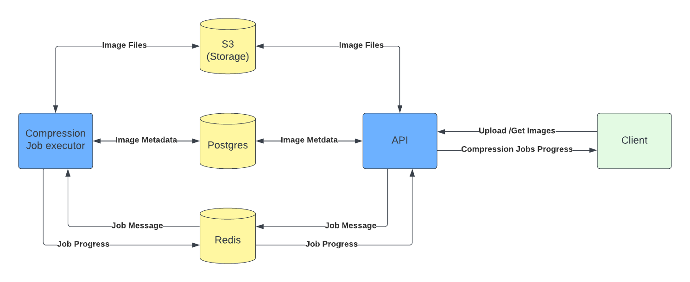

# Image Processor API

## Prerequisites
- Go 1.24.2 or later
- PostgreSQL database
- S3-compatible storage (AWS S3 or MinIO)

## To run the app
`go mod download`

`go run .`

# System architecture

<h2>Related services</h2>
<ul>
    <li><a href="https://github.com/vaibhav-patil07/image-processor-ui">UI (React)</a></li>
    <li><a href="https://github.com/vaibhav-patil07/image-processor-job-executor">Job executor (Python)</a></li>
</ul>
<h2>Older version of image compressor</h2>
<a href="https://github.com/vaibhav-patil07/Image-Size-Reducer-FastApi">https://github.com/vaibhav-patil07/Image-Size-Reducer-FastApi</a>

## License
This project is licensed under the MIT License.
